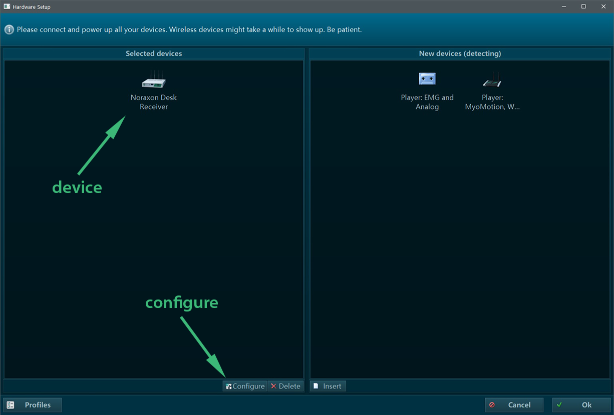
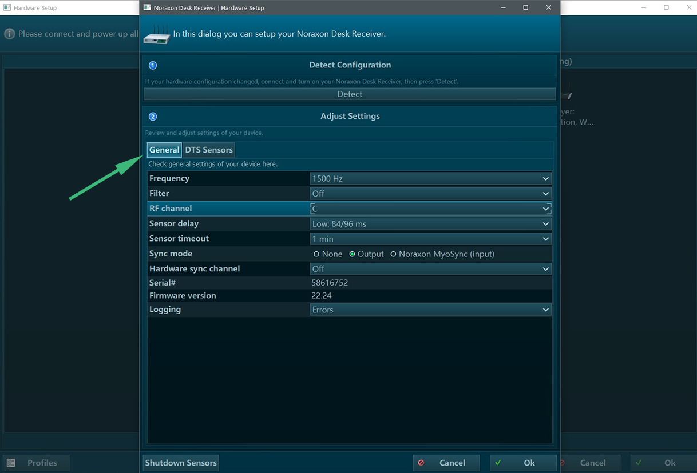
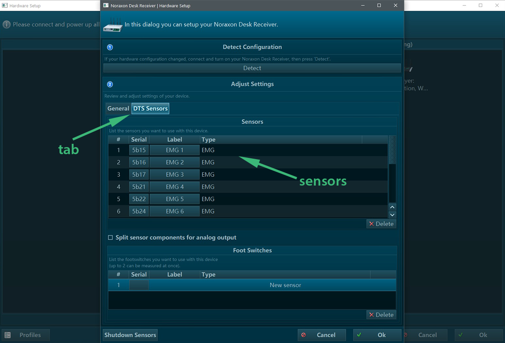

# emgAcquire

A C++ project for acquiring EMG signals from a Noraxon DTS system and stream the packets over a TCP/IP connection. The package works only on Windows but the clients could work on any platform. The signal acquisition in based on the Easy2.AcquireCom library and the TCP/IP communication is based on the socketStream library [link](https://github.com/yias/socketStream). The project is developed on Visual Studio Code.

The package is distributed under the GNU GPL v3 license.

## Description

The emgAcquire application is a software for acquiring, record and stream EMG signals. Additionally, it provides the option of introducing audio cues during the recording of the signals. The application can be found in folder "bin" and it runs only on Windows systems.

The package also provides a cross-platform C++ API and Python module for receiving the EMG signals remotely, the emgAcquireClient. Examples of how to use the emgAcquireClient API and Python module can be found in the folder "client_examples". The emgAcquireClient API and Python module is tested on Windows and Linux machines, while hopefully it works on MacOS too.


## Set-up

<ins> Main application </ins>

The application has a run-time dependency on the Easy2.AcquireCom library, meaning that Easy2.AcquireCom should be installed on the system before running the application. To get the Easy2.AcquireCom library, contact Noraxon support service for the Noraxon.Acquire patch.

The pre-compiled executable is inside the "bin" folder and it doesn't require any further installation. If you need to re-compile the application, the package has the following dependencies:

1) the rapidjson library from Tencent. This is a third-party dependency, the headers of which should be included for compilation. The rapidjson library can be fould in its github repo [link](https://github.com/Tencent/rapidjson).

2) the Microsoft Active Template Library (ATL). ATL can be installed on the system through a Visual Studio Installer. It is also strongly suggested to install the Microsoft's C++ Build Tools for Visual Studio, together with the ATL package through a Visual Studio Installer. However, there is no requirement to install or compile the project on Visual Studio. 

3) the socketStream package which handles the TCP/IP connection with the client. socketStream is also a submodule of the emgAcquire package and could be cloned together by typing:

```bash
$ git clone --recurse-submodule https://github.com/yias/emgAcquire.git
```
or 

```bash
$ git clone https://github.com/yias/emgAcquire.git
$ git submodule update --init
```

In order to have the proper compilation environment for the emgAcquire app, it is preferred to compile the project from a Developer Powershell for VS2019. Since Easy2.AcquireCom is a 32-bit application, the target of the compiler should be the x86 architecture. 

Furthermore, it is possible to compile the project with both g++ and Visual C++ (cl). However, it is suggested to compile the project with Visual C++, if you don't have g++ installed on your system and you want to avoid looking for linking libraries. In case you want to use g++, the ws2_32 library should be linked to the project (add -lws2_32 in the compilation command). If you use VSCode as IDE, look at the "tasks.json" file inside the folder ".vscode" for examples of compilation commands with Visual C++ and g++. 


<ins> Client library </ins>

The emgAcquireClient API depends on the Tencent's rapidjson and the socketStream packages only (steps 1 and 3 are required). The API can work on both Linux and Windows systems and can be compiled for x86 (32-bit) and x64 (64-bit) applications. In case you use g++ for compliling the project, the ws2_32 linrary should be linked for Windows systems whilst the pthread library should be linked for Linux systems. Examples of compilation commands could be found in the provided makefile. 

## Running the application

Navigate in the directory of the package and run the executable emgAcquire.exe from a command prompt:

```bash
> .\bin\emgAcquire.exe 
```

Once the application has been launched, it will ask you to fill the options of acquisition. This optios are:
- the number of EMG channels to acquire (integer from 1 to 16)
- recording the signals to a csv file (true or false - yes or no)
- in the case of recording the signals:
    - name of the file to save the signals (string)
- streaming the signals (true or false - yes or no)
- in the case of streaming the seignals:
    - the IP of the machine (string)
    - and the port to open (integer)
- if an audio cue is required for recording the singals (true or false - yes or no)
- in the case an audio cue is required: 
    - the sentences of the cues (array of strings: ["one", "two", "three", "Four"])
    - the number of repetitions of the audio cues (integer)

Except the number of EMG signals to be acquired, all the other options are optional. There is also the option of introducing a configuration file as input argument of the executable. 

```bash
> .\bin\emgAcquire.exe [name_of_config_file].json
```

The configuration file should be a json file and it should follow the json syntax. Additionally, the configuration file should exist in the folder "cfg". A minimal configuration file for acquire 1 signal and stream the data locally on the machine is the following:
```json
{
    "nb_channels": 1,
    "streamSignals": 1,
    "serverIP": "localhost",
    "port": 10352
}
```

An example of configuration file with all the options is included in the "cfg" folder.

## Noraxon DTS Set-up

Once you launch the executable, the window of the hardware set-up will pop-up. The first time that you launch the application, the hardware must be set-up. If the Noraxon DTS Receiver is connected and switched-on, it will appear under the panel 'New devices".


Drag the Noraxon Desk Receiver and drop it in the panel "Selected devices" and revome all the other devices in this panel. Select the Noraxon Desk Receiver icon and click on "Configure" to configure the device. 



The tap "General" contains a set of options for the signal acquisition. You can use the same options as the picture below, or you can select other options depending on your application. 



In the tab "DTS Sensors" add the sensors you would like to receive the signals from, see the picture below. The serial number corresponds to the 4-digit code on the probe. You can customize the label according to your application. The labels of the sensors do not influence the acquisition of the signals. However, the number of sensors introduced in this panel should be equal or greater than the number of EMG channels selected in the application. 



Click "Ok" to save the configuration and close the two windows. The acquisition of the signals will start soon after that.

## emgAcquireClient C++ API

An example on how to use the emgAcquireClient C++ API could be found in the folder "client_examples". A mimimal code for running acquiring the signals from the server is the following:

```c++
// define the acquisition frequency of the packet signals
float freq = 20;

// define the number of channels to acquire
float nb_ch = 6;

// create an emgAcquireClient object for listening to the server
emgAcquire::Client emgListener(freq, nb_ch);

// initialize the listener (connecting to the server)
emgListener.initialize()

// define a vector of vectors to host the data
std::vector< std::vector<double>> mydata;

// start filling the buffer
emgListener.start();

// get the next set of data from the buffer
mydata = emgListener.getSignals();

// shutdown the listener
emgListener.shutdown();
```

In order to the client initialization to succeed, the server of emgAcquire app should be running.

## emgAcquireClient Python module

Examples on how to use the emgAcquireClient Python module could be found in the folder "client_examples". A mimimal code for running acquiring the signals from the server is the following:

```python
import sys
import pathlib

# deifne the directory of the emgAcquireClient python_module 
emgAquire_dir = str(pathlib.Path().absolute()) + "/../python_module"

# import the module

# append the path including the directory of the python_module
sys.path.append(emgAquire_dir)

# import the module
import emgAcquireClient


# define number of channels to acquire
nb_ch = 6

# create an emgClient object for acquiring the data
emgClient = emgAcquireClient.emgAcquireClient(nb_channels=nb_ch)

# initialize the node
init_test = emgClient.initialize()

# start filling the buffer
emgClient.start()

# get the next set of data from the buffer
emg_data = emgClient.getSignals()

# shutdown the acquisition node
emgClient.shutdown()

```

In order to the client initialization to succeed, the server of emgAcquire app should be running.
